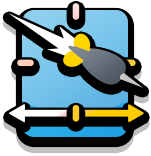
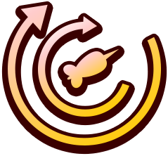

<h1>Artifact Changes</h1>

| Artifact | Common | Rare | Legendary |
|----------|--------|------|-----------|
| <a href="/ArtifactChanges/AbilityStacking.cs"> 
   Ability Stacking 
</a> | Ability cooldowns loop to gain 1 extra  ~~charge. Ability cooldowns are 20% slower for all Monkeys except Psi~~  **charge**  | Ability cooldowns loop to gain 2 extra  ~~charges. Ability cooldowns are 20% slower for all Monkeys except Psi~~  **charges**  | Ability cooldowns loop to gain 3 extra  ~~charges. Ability cooldowns are 20% slower for all Monkeys except Psi~~  **charges**  |
| <a href="/ArtifactChanges/AbsoluteAbility.cs"> 
   Absolute Ability 
</a> | Monkeys attack  ~~10%~~  **5%**  slower, but ability cooldowns are 25% faster | Monkeys attack  ~~10%~~  **5%**  slower, but ability cooldowns are 30% faster | Monkeys attack  ~~10%~~  **5%**  slower, but ability cooldowns are 40% faster |
| <a href="/ArtifactChanges/AlchemicEngineering.cs"> 
   Alchemic Engineering 
</a> | Tier 3 and higher Engineers  ~~have pierce reduced 60%, but~~ convert Bloons to Gold. Adds a 0-1-1 Engineer to your Party | Tier 3 and higher Engineers have pierce  ~~reduced 45%, but~~  **increased 15% and** convert Bloons to Gold. Adds a 0-1-2 Engineer to your Party | Tier 3 and higher Engineers  **have pierce increased 45% and** convert Bloons to Gold. Adds a 0-0-2 Engineer to your Party |
| <a href="/ArtifactChanges/BBGatlingGun.cs"> 
   BB Gatling Gun 
</a> | Main attack damage of Monkeys is reduced to  ~~85%~~  **90%**, but attack reload time is reduced 15% | Main attack damage of Monkeys is reduced to  ~~75%~~  **85%**, but attack reload time is reduced 25% | Main attack damage of Monkeys is reduced to  ~~60%~~  **80%**, but attack reload time is reduced 40% |
| <a href="/ArtifactChanges/CriticalSuccess.cs"> 
   Critical Success 
</a> | — | Primary Monkeys attack reload time increased  ~~75%~~  **50%**, but gain a 1 in 10 chance to Crit for 900% damage | Primary Monkeys attack reload time increased  ~~75%~~  **50%**, but gain a 1 in 10 chance to Crit for 1100% damage |
| <a href="/ArtifactChanges/DazingFrostburn.cs"> 
   Dazing Frostburn 
</a> | Ice Monkeys  ~~attack 50% slower, but also~~ stun non-MOAB Bloons and burn 4 damage a second for 10 seconds. Adds a 1-0-1 Ice Monkey to your Party | Ice Monkeys  ~~attack 50% slower, but also~~ stun non-MOAB Bloons and burn 8 damage a second for 10 seconds. Adds a 1-0-2 Ice Monkey to your Party | Ice Monkeys  ~~attack 50% slower, but also~~ stun non-MOAB Bloons and burn 16 damage a second for 10 seconds. Adds a 0-0-2 Ice Monkey to your Party |
| <a href="/ArtifactChanges/DreamTeams.cs"> 
   Dream Teams 
</a> | Monkey Subs, Ninja Monkeys, Druids, Wizards, and Beast Handlers have  **10%** faster attack speed and ability cooldowns, and 25% more range. | Monkey Subs, Ninja Monkeys, Druids, Wizards, and Beast Handlers have  **10%** faster attack speed and ability cooldowns, and 35% more range. | Monkey Subs, Ninja Monkeys, Druids, Wizards, and Beast Handlers have  **10%** faster attack speed and ability cooldowns, and 50% more range. |
| <a href="/ArtifactChanges/EssenceOfBlastapopoulos.cs"> 
   Essence Of Blastapopoulos 
</a> | — | — |  **Heroes and** Tier 5 Monkeys  ~~and level 20 Heroes~~ burn Bloons, and affected Bloons take an extra  ~~+4~~  **+2** damage from all sources |
| <a href="/ArtifactChanges/EssenceOfDreadbloon.cs"> 
   Essence Of Dreadbloon 
</a> | — | — | All Monkeys count as all categories.  **Heroes and** Tier 5 Monkeys  ~~and level 20 Heroes~~ deal 1.5x damage to Fortified and Ceramic Bloons |
| <a href="/ArtifactChanges/EssenceOfVortex.cs"> 
   Essence Of Vortex 
</a> | — | — |  **Heroes and** Tier 5 Monkeys  ~~and level 20 Heroes~~ knock back MOAB-Class Bloons on hit, and 10% chance to blow back regular Bloons |
| <a href="/ArtifactChanges/ExplosiveEconomics.cs"> 
   Explosive Economics 
</a> | When Support Monkeys are sold, an Area of Effect explosion deals 100 damage to all nearby  ~~Bloons. Bloons in range of Support Monkeys give 5% less cash~~  **Bloons**  | When Support Monkeys are sold, an Area of Effect explosion deals 300 damage to all nearby  ~~Bloons. Bloons in range of Support Monkeys give 5% less cash~~  **Bloons**  | When Support Monkeys are sold, an Area of Effect explosion deals 900 damage to all nearby  ~~Bloons. Bloons in range of Support Monkeys give 5% less cash~~  **Bloons**  |
| <a href="/ArtifactChanges/FlamingHotPunchARang.cs"> 
   Flaming Hot  ~~Punch-A-Rang~~  **Punch**  
</a> | Red Hot Rangs  ~~have reduced pierce, but~~  **, White Hot Spikes, Hot Shots, and Heat-tipped Darts** knock back Bloons and have a 30% chance to set them on fire for 3 damage per 1.5s over 4.5s. Adds a 0-1-1 Boomerang Monkey to your Party | Red Hot Rangs  ~~have reduced pierce, but~~  **, White Hot Spikes, Hot Shots, and Heat-tipped Darts** knock back Bloons and have a 30% chance to set them on fire for 6 damage per 1.5s over 4.5s. Adds a 0-1-2 Boomerang Monkey to your Party | Red Hot Rangs  ~~have reduced pierce, but~~  **, White Hot Spikes, Hot Shots, and Heat-tipped Darts** knock back Bloons and have a 30% chance to set them on fire for 12 damage per 1.5s over 4.5s. Adds a 0-0-2 Boomerang Monkey to your Party |
| <a href="/ArtifactChanges/FollowMe.cs"> 
   Follow Me 
</a> | Dart Monkeys, Boomerang Monkeys, Bomb Shooters, Tack Shooters, Super Monkeys, Druids, and Mermonkeys follow cursor like a Dartling Gunner with a turn rate of 180, and constantly fire as long as Bloons are on  ~~screen. Attack speed reduced by 20%~~  **screen**  | Dart Monkeys, Boomerang Monkeys, Bomb Shooters, Tack Shooters, Super Monkeys, Druids, and Mermonkeys follow cursor like a Dartling Gunner with a turn rate of 300, and constantly fire as long as Bloons are on  ~~screen. Attack speed reduced by 10%~~  **screen**  | Dart Monkeys, Boomerang Monkeys, Bomb Shooters, Tack Shooters, Super Monkeys, Druids, and Mermonkeys follow cursor like a Dartling Gunner with a turn rate of 500, and constantly fire as long as Bloons are on  ~~screen. Attack speed reduced by 5%~~  **screen**  |
| <a href="/ArtifactChanges/GrowingSteady.cs"> 
   Growing Steady 
</a> |  ~~Druids attack reload time is increased 20%, but every round,~~ Druid damage is increased by 0.15, even Druids placed later! Adds a 1-0-1 Druid to your Party |  ~~Druids attack reload time is increased 20%, but every round,~~ Druid damage is increased by 0.20, even Druids placed later! Adds a 1-0-2 Druid to your Party |  ~~Druids attack reload time is increased 20%, but every round,~~ Druid damage is increased by 0.35, even Druids placed later! Adds a 0-0-2 Druid to your Party |
| <a href="/ArtifactChanges/HeightenedPerception.cs"> 
   Heightened Perception 
</a> | Primary Monkeys attack range increased 40%. Projectile speed reduced  ~~50%~~  **25%**  | Primary Monkeys attack range increased 55%. Projectile speed reduced  ~~50%~~  **25%**  | Primary Monkeys attack range increased 75%. Projectile speed reduced  ~~50%~~  **25%**  |
| <a href="/ArtifactChanges/IntelligenceAgent.cs"> 
   Intelligence Agent 
</a> | Heroes give Monkey Intelligence Bureau buff to nearby Monkeys (can hit all Bloon types) but  ~~those monkeys attack reload time is increased 50%~~  **these monkeys have 30% reduced range**  | Heroes give Monkey Intelligence Bureau buff to nearby Monkeys (can hit all Bloon types) but  ~~those monkeys attack reload time is increased 40%~~  **these monkeys have 15% reduced range**  | Heroes give Monkey Intelligence Bureau buff to nearby Monkeys (can hit all Bloon  ~~types) but those monkeys attack reload time is increased 25%~~  **types)**  |
| <a href="/ArtifactChanges/MightyMulligan.cs"> 
   Mighty Mulligan 
</a> | Provides 1 Artifact Selection reroll opportunity after beating a reward  ~~tile~~  **tile. Refreshes at start of stage**  | Provides 2 Artifact Selection reroll opportunity after beating a reward  ~~tile~~  **tile. Refreshes at start of stage**  | Provides 3 Artifact Selection reroll opportunity after beating a reward  ~~tile~~  **tile. Refreshes at start of stage**  |
| <a href="/ArtifactChanges/SlowAndSteady.cs"> 
   Slow And Steady 
</a> | Monkey damage increased 100%. For the first 20s of each round, all Monkeys attack  ~~2x~~  **1.75x** slower | Monkey damage increased 100%. For the first 20s of each round, all Monkeys attack 1. ~~8x~~  **65x** slower | Monkey damage increased 100%. For the first 20s of each round, all Monkeys attack 1.5x slower |
| <a href="/ArtifactChanges/SpiritOfAdventure.cs"> 
   Spirit of Adventure 
</a> | Hero end of round XP increased 45% and Hero attack speed increased 10% ~~. Non-Hero Monkeys attack speed reduced 10%~~  | Hero end of round XP increased 60% and Hero attack speed increased 10% ~~. Non-Hero Monkeys attack speed reduced 10%~~  | Hero end of round XP increased 80% and Hero attack speed increased 10% ~~. Non-Hero Monkeys attack speed reduced 10%~~  |
| <a href="/ArtifactChanges/SwellingSpikes.cs"> 
   Swelling Spikes 
</a> | Spike Factories attack half as fast, but have  ~~115%~~  **130%**  more pierce. Adds a 1-0-1 Spike Factory to your Party | Spike Factories attack half as fast, but have  ~~120%~~  **140%**  more pierce. Adds a 2-0-1 Spike Factory to your Party | Spike Factories attack half as fast, but have  ~~135%~~  **170%**  more pierce. Adds a 2-0-0 Spike Factory to your Party |
| <a href="/ArtifactChanges/TheUnspokenHeroes.cs"> 
   The Unspoken Heroes 
</a> | Support Monkeys have a 1 in 10 chance to Crit for 250%  ~~damage. Heroes attack speed and end of round experience is reduced 15%~~  **damage**  | Support Monkeys have a 1 in 10 chance to Crit for 350%  ~~damage. Heroes attack speed and end of round experience is reduced 15%~~  **damage**  | Support Monkeys have a 1 in 10 chance to Crit for 500%  ~~damage. Heroes attack speed and end of round experience is reduced 15%~~  **damage**  |
| <a href="/ArtifactChanges/TitForTat.cs"> 
   Tit For Tat 
</a> | All Monkeys attack 15% faster. Bloons move  ~~25%~~  **15%**  faster when in range of Monkeys | All Monkeys attack 20% faster. Bloons move  ~~25%~~  **15%**  faster when in range of Monkeys | All Monkeys attack 40% faster. Bloons move  ~~25%~~  **15%**  faster when in range of Monkeys |
<h1>Boost Changes</h1>

| Boost | Common | Rare | Legendary |
|----------|--------|------|-----------|
| <a href="/ArtifactChanges/BoostArtifactChange.cs"> 
   Primary Inspiration 
</a> | Primary Monkeys have  ~~10%~~  **7%**  more pierce, and have increased attack range | Primary Monkeys have  ~~14%~~  **9%**  more pierce, and have increased attack range | Primary Monkeys have  ~~18%~~  **12%**  more pierce, and have increased attack range |
| <a href="/ArtifactChanges/BoostArtifactChange.cs"> 
   Primary Precision 
</a> | Increases Primary Monkey damage by  ~~15%~~  **10%**, and reduces shot spread  ~~10%~~  **7%**  | Increases Primary Monkey damage by  ~~20%~~  **13%**, and reduces shot spread  ~~15%~~  **10%**  | Increases Primary Monkey damage by  ~~30%~~  **20%**, and reduces shot spread  ~~25%~~  **17%**  |
| <a href="/ArtifactChanges/BoostArtifactChange.cs"> 
   Primary Quickening 
</a> | Reduces Primary Monkeys attack reload and ability cooldown time  ~~10%~~  **7%**, and projectiles travel  ~~20%~~  **13%**  faster | Reduces Primary Monkeys attack reload and ability cooldown time  ~~15%~~  **10%**, and projectiles travel  ~~25%~~  **17%**  faster | Reduces Primary Monkeys attack reload and ability cooldown time  ~~25%~~  **17%**, and projectiles travel  ~~35%~~  **23%**  faster |
| <a href="/ArtifactChanges/BoostArtifactChange.cs"> 
   Military Inspiration 
</a> | Military Monkeys have  ~~10%~~  **7%**  more pierce, and have increased attack range | Military Monkeys have  ~~14%~~  **9%**  more pierce, and have increased attack range | Military Monkeys have  ~~18%~~  **12%**  more pierce, and have increased attack range |
| <a href="/ArtifactChanges/BoostArtifactChange.cs"> 
   Military Precision 
</a> | Increases Military Monkey damage by  ~~15%~~  **10%**, and reduces shot spread  ~~10%~~  **7%**  | Increases Military Monkey damage by  ~~20%~~  **13%**, and reduces shot spread  ~~15%~~  **10%**  | Increases Military Monkey damage by  ~~30%~~  **20%**, and reduces shot spread  ~~25%~~  **17%**  |
| <a href="/ArtifactChanges/BoostArtifactChange.cs"> 
   Military Quickening 
</a> | Reduces Military Monkeys attack reload and ability cooldown time  ~~10%~~  **7%**, and projectiles travel  ~~20%~~  **13%**  faster | Reduces Military Monkeys attack reload and ability cooldown time  ~~15%~~  **10%**, and projectiles travel  ~~25%~~  **17%**  faster | Reduces Military Monkeys attack reload and ability cooldown time  ~~25%~~  **17%**, and projectiles travel  ~~35%~~  **23%**  faster |
| <a href="/ArtifactChanges/BoostArtifactChange.cs"> 
   Magic Inspiration 
</a> | Magic Monkeys have  ~~10%~~  **7%**  more pierce, and have increased attack range | Magic Monkeys have  ~~14%~~  **9%**  more pierce, and have increased attack range | Magic Monkeys have  ~~18%~~  **12%**  more pierce, and have increased attack range |
| <a href="/ArtifactChanges/BoostArtifactChange.cs"> 
   Magic Precision 
</a> | Increases Magic Monkey damage by  ~~15%~~  **10%**, and reduces shot spread  ~~10%~~  **7%**  | Increases Magic Monkey damage by  ~~20%~~  **13%**, and reduces shot spread  ~~15%~~  **10%**  | Increases Magic Monkey damage by  ~~30%~~  **20%**, and reduces shot spread  ~~25%~~  **17%**  |
| <a href="/ArtifactChanges/BoostArtifactChange.cs"> 
   Magic Quickening 
</a> | Reduces Magic Monkeys attack reload and ability cooldown time  ~~10%~~  **7%**, and projectiles travel  ~~20%~~  **13%**  faster | Reduces Magic Monkeys attack reload and ability cooldown time  ~~15%~~  **10%**, and projectiles travel  ~~25%~~  **17%**  faster | Reduces Magic Monkeys attack reload and ability cooldown time  ~~25%~~  **17%**, and projectiles travel  ~~35%~~  **23%**  faster |
| <a href="/ArtifactChanges/BoostArtifactChange.cs"> 
   Support Inspiration 
</a> | Support Monkeys have  ~~10%~~  **7%**  more pierce, and have increased attack range | Support Monkeys have  ~~14%~~  **9%**  more pierce, and have increased attack range | Support Monkeys have  ~~18%~~  **12%**  more pierce, and have increased attack range |
| <a href="/ArtifactChanges/BoostArtifactChange.cs"> 
   Support Precision 
</a> | Increases Support Monkey damage by  ~~15%~~  **10%**, and reduces shot spread  ~~10%~~  **7%**  | Increases Support Monkey damage by  ~~20%~~  **13%**, and reduces shot spread  ~~15%~~  **10%**  | Increases Support Monkey damage by  ~~30%~~  **20%**, and reduces shot spread  ~~25%~~  **17%**  |
| <a href="/ArtifactChanges/BoostArtifactChange.cs"> 
   Support Quickening 
</a> | Reduces Support Monkeys attack reload and ability cooldown time  ~~10%~~  **7%**, and projectiles travel  ~~20%~~  **13%**  faster | Reduces Support Monkeys attack reload and ability cooldown time  ~~15%~~  **10%**, and projectiles travel  ~~25%~~  **17%**  faster | Reduces Support Monkeys attack reload and ability cooldown time  ~~25%~~  **17%**, and projectiles travel  ~~35%~~  **23%**  faster |
| <a href="/ArtifactChanges/BoostArtifactChange.cs"> 
   All Tower Inspiration 
</a> | All Monkeys have  ~~5%~~  **3%**  more pierce, and have increased attack range | All Monkeys have  ~~7%~~  **5%**  more pierce, and have increased attack range | All Monkeys have  ~~9%~~  **6%**  more pierce, and have increased attack range |
| <a href="/ArtifactChanges/BoostArtifactChange.cs"> 
   All Tower Precision 
</a> | Increases all Monkeys damage  ~~8%~~  **5%**, and shot spread reduced  ~~5%~~  **3%**  | Increases all Monkeys damage  ~~10%~~  **7%**, and shot spread reduced  ~~7%~~  **5%**  | Increases all Monkeys damage  ~~15%~~  **10%**, and shot spread reduced  ~~12%~~  **8%**  |
| <a href="/ArtifactChanges/BoostArtifactChange.cs"> 
   All Tower Quickening 
</a> | Reduces all Monkeys attack reload and ability cooldown time  ~~5%~~  **3%**, and projectiles travel  ~~10%~~  **7%**  faster | Reduces all Monkeys attack reload and ability cooldown time  ~~7%~~  **5%**, and projectiles travel  ~~13%~~  **9%**  faster | Reduces all Monkeys attack reload and ability cooldown time  ~~12%~~  **8%**, and projectiles travel  ~~18%~~  **12%**  faster |
