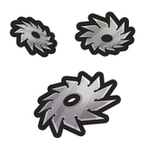
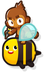
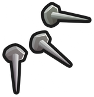
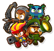
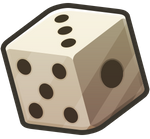
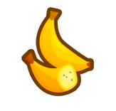

<h1>New Artifacts</h1>

| Artifact | Common | Rare | Legendary |
|----------|--------|------|-----------|
| <a href="/NewArtifacts/AreWeThereYet.cs"> 
   Are We There Yet 
</a> | Insta Monkey cooldowns are 1 turn shorter | Insta Monkey cooldowns are 2 turns shorter | Insta Monkey cooldowns are 3 turns shorter |
| <a href="/NewArtifacts/BladeLord.cs"> 
   Blade Lord 
</a> | — | Blade Shooters are permanently orbited by three of their projectiles that damage Bloons every 0.5 seconds. Adds a 0-2-1 Tack Shooter to your Party | Blade Shooters are permanently orbited by three of their projectiles that damage Bloons every 0.3 seconds. Adds a 0-2-0 Tack Shooter to your Party |
| <a href="/NewArtifacts/CrystalBall.cs"> 
   Crystal Ball 
</a> | Wizard Monkeys attack 15% faster and have long range targeting within the ranges of other towers. Adds a 1-1-0 Wizard Monkey to your Party | Wizard Monkeys attack 20% faster and have long range targeting within the ranges of other towers. Adds a 2-1-0 Wizard Monkey to your Party | Wizard Monkeys attack 30% faster and have long range targeting within the ranges of other towers. Adds a 2-0-0 Wizard Monkey to your Party |
| <a href="/NewArtifacts/DoubleCash.cs"> 
   Double Cash 
</a> | — | — | Starting cash and cash per pop is doubled. All towers attack 50% slower |
| <a href="/NewArtifacts/DoubleRanga.cs"> 
   Double Ranga 
</a> | Boomerang Monkeys throw 2 Boomerangs at once but have 70% increased reload time. Adds a 1-0-0 Boomerang Monkey to your Party | Boomerang Monkeys throw 2 Boomerangs at once but have 60% increased reload time. Adds a 2-0-0 Boomerang Monkey to your Party | Boomerang Monkeys throw 2 Boomerangs at once but have 40% increased reload time. Adds a 2-0-0 Boomerang Monkey to your Party |
| <a href="/NewArtifacts/Downsizing.cs"> 
   Downsizing 
</a> | Towers cost 10% less and are 10% smaller | Towers cost 15% less and are 15% smaller | Towers cost 25% less and are 25% smaller |
| <a href="/NewArtifacts/Dreadnought.cs"> 
   Dreadnought 
</a> | Monkey Buccaneers deal 15% more damage by shooting molten cannonballs that can pop Frozen and Lead Bloons. Adds a 1-1-0 Monkey Buccaneer to your Party | Monkey Buccaneers deal 20% more damage by shooting molten cannonballs that can pop Frozen and Lead Bloons. Adds a 2-1-0 Monkey Buccaneer to your Party | Monkey Buccaneers deal 30% more damage by shooting molten cannonballs that can pop Frozen and Lead Bloons. Adds a 2-0-0 Monkey Buccaneer to your Party |
| <a href="/NewArtifacts/EnchantedWeapons.cs"> 
   Enchanted Weapons 
</a> | Ninja Monkeys' Shurikens and Mermonkeys' Tridents can hit all Bloon types, and they have 10% increased damage and pierce. Adds a 2-0-0 Ninja Monkey to your Party | Ninja Monkeys' Shurikens and Mermonkeys' Tridents can hit all Bloon types, and they have 20% increased damage and pierce. Adds a 2-0-0 Mermonkey to your Party | Ninja Monkeys' Shurikens and Mermonkeys' Tridents can hit all Bloon types, and they have 30% increased damage and pierce. Adds a 3-0-0 Ninja Monkey to your Party |
| <a href="/NewArtifacts/ExplosiveGrowth.cs"> 
   Explosive Growth 
</a> | All Explosions are 20% larger and have 10% increased pierce and damage | All Explosions are 30% larger and have 15% increased pierce and damage | All Explosions are 50% larger and have 25% increased pierce and damage |
| <a href="/NewArtifacts/FasterFasteners.cs"> 
   Faster Fasteners 
</a> | Tack Shooters' Tacks and Engineers' Nails travel 15% faster, and they have 15% increased attack speed. Adds a 2-0-2 Engineer Monkey to your Party | Tack Shooters' Tacks and Engineers' Nails travel 20% faster, and they have 20% increased attack speed. Adds a 2-0-2 Tack Shooter to your Party | Tack Shooters' Tacks and Engineers' Nails travel 35% faster, and they have 35% increased attack speed. Adds a 0-0-3 Engineer Monkey to your Party |
| <a href="/NewArtifacts/GiveMeFive.cs"> 
   Give Me Five 
</a> | — | — | You can have up to 2 of each Tier 5 tower. Tier 5 upgrades and instas cost 50% less |
| <a href="/NewArtifacts/GorillaGlue.cs"> 
   Gorilla Glue 
</a> | Glue effects slow Bloons down 20% more, and damage Bloons 2x faster. Adds a 1-1-0 Glue Gunner to your Party | Glue effects slow Bloons down 30% more, and damage Bloons 3x faster. Adds a 1-2-0 Glue Gunner to your Party | Glue effects slow Bloons down 50% more, and damage Bloons 5x faster. Adds a 0-2-0 Glue Gunner to your Party |
| <a href="/NewArtifacts/GottaGoFast.cs"> 
   Gotta Go Fast 
</a> | All Monkeys with a "Faster _____" upgrade attack an extra 15% faster | All Monkeys with a "Faster _____" upgrade attack an extra 20% faster | All Monkeys with a "Faster _____" upgrade attack an extra 35% faster |
| <a href="/NewArtifacts/HeavyHitter.cs"> 
   Heavy Hitter 
</a> | Dart Monkey projectiles move 50% slower but they last 25% longer and are able to rehit the same Bloon every 0.3 seconds. Adds a 1-0-1 Dart Monkey to your Party | Dart Monkey projectiles move 50% slower but they last 35% longer and are able to rehit the same Bloon every 0.2 seconds. Adds a 2-0-1 Dart Monkey to your Party | Dart Monkey projectiles move 50% slower but they last 50% longer and are able to rehit the same Bloon every 0.1 seconds. Adds a 2-0-0 Dart Monkey to your Party |
| <a href="/NewArtifacts/HoverPlanes.cs"> 
   Hover Planes 
</a> | Monkey Aces deal 10% more damage and now fly like Heli Pilots. The Centered Path upgrade unlocks Pursuit mode. Adds a 1-0-1 Monkey Ace to your Party | Monkey Aces deal 15% more damage and now fly like Heli Pilots. The Centered Path upgrade unlocks Pursuit mode. Adds a 1-0-2 Monkey Ace to your Party | Monkey Aces deal 25% more damage and now fly like Heli Pilots. The Centered Path upgrade unlocks Pursuit mode. Adds a 0-0-2 Monkey Ace to your Party |
| <a href="/NewArtifacts/ItsATrap.cs"> 
   Its A Trap 
</a> | Grants 1 Camo Trap and Glue Trap per tile | Grants 2 Camo Trap and Glue Trap per tile | Grants 3 Camo Trap and Glue Trap per tile |
| <a href="/NewArtifacts/LaserSharp.cs"> 
   Laser Sharp 
</a> | Super Monkeys with Laser Blasts (but not Plasma Blasts) apply Laser Shock. All Lasers deal 25% more damage to Shocked Bloons and can hit all Bloon types. Adds a 2-0-0 Dartling Gunner to your Party | Super Monkeys with Laser Blasts (but not Plasma Blasts) apply Laser Shock. All Lasers deal 35% more damage to Shocked Bloons and can hit all Bloon types. Adds a 1-0-0 Super Monkey to your Party | Super Monkeys with Laser Blasts (but not Plasma Blasts) apply Laser Shock. All Lasers deal 50% more damage to Shocked Bloons and can hit all Bloon types. Adds a 3-0-0 Dartling Gunner to your Party |
| <a href="/NewArtifacts/MainCharacter.cs"> 
   Main Character 
</a> | Heroes now count as Primary, Military, Magic, and Support towers. Hero attack range reduced by 20% | Heroes now count as Primary, Military, Magic, and Support towers. Hero attack range reduced by 10% | Heroes now count as Primary, Military, Magic, and Support towers. |
| <a href="/NewArtifacts/NeverTellMeTheOdds.cs"> 
   Never Tell Me The Odds 
</a> | Critical Hits and other random chance effects for towers are 50% more common | Critical Hits and other random chance effects for towers are 100% more common | Critical Hits and other random chance effects for towers are 200% more common |
| <a href="/NewArtifacts/NowYouSeeMe.cs"> 
   Now You See Me 
</a> | Grants Camo detection to all Towers and Heroes that cannot naturally attack Camo Bloons before Tier 5 / Level 20. | Grants Camo detection and 2x Camo damage to all Towers and Heroes that cannot naturally attack Camo Bloons before Tier 5 / Level 20. | Grants Camo detection and 4x Camo damage to all Towers and Heroes that cannot naturally attack Camo Bloons before Tier 5 / Level 20. |
| <a href="/NewArtifacts/Oktoberfest.cs"> 
   Oktoberfest 
</a> | Alchemist buff potions last for 50% more shots. Adds a 1-1-0 Alchemist to your Party | Alchemist buff potions last for 100% more shots. Adds a 2-1-0 Alchemist to your Party | Alchemist buff potions last for 200% more shots. Adds a 2-0-0 Alchemist to your Party |
| <a href="/NewArtifacts/Overtime.cs"> 
   Overtime 
</a> | Engineers and Sentries permanently have a 50% effectiveness Overlock applied to them (20% reduced reload time). Adds a 0-1-1 Engineer Monkey to your Party | Engineers and Sentries permanently have a 70% effectiveness Overlock applied to them (28% reduced reload time). Adds a 0-2-0 Engineer Monkey to your Party | Engineers and Sentries permanently have a 100% effectiveness Overlock applied to them (40% reduced reload time). Adds a 0-2-0 Engineer Monkey to your Party |
| <a href="/NewArtifacts/PartMonkeyPartMachine.cs"> 
   Part Monkey Part Machine 
</a> | Bionic Boomers and Robo Monkeys have 15% increased damage and ability cooldown rate. Adds a 0-3-0 Boomerang Monkey to your Party | Bionic Boomers and Robo Monkeys have 25% increased damage and ability cooldown rate. Adds a 0-3-0 Super Monkey to your Party | Bionic Boomers and Robo Monkeys have 40% increased damage and ability cooldown rate. Adds a 0-4-0 Boomerang Monkey to your Party |
| <a href="/NewArtifacts/PayRaise.cs"> 
   Pay Raise 
</a> | Gain 1 additional token whenever you defeat a Bloon Encounter | Gain 2 additional tokens whenever you defeat a Bloon Encounter | Gain 3 additional tokens whenever you defeat a Bloon Encounter |
| <a href="/NewArtifacts/PrecisionMunition.cs"> 
   Precision Munition 
</a> | — | Bomb Shooters have 20% more pierce and global range. Bombs instantly explode at the target's location. Adds a 2-1-0 Bomb Shooter to your Party | Bomb Shooters have 40% more pierce and global range. Bombs instantly explode at the target's location. Adds a 2-0-0 Bomb Shooter to your Party |
| <a href="/NewArtifacts/ShinobisStudio.cs"> 
   Shinobi's Studio 
</a> | All Ninjas provide a stack of Shinobi Tactics to each other. Adds a 0-1-1 Ninja Monkey to your Party | All Ninjas provide a stack of Shinobi Tactics to each other. Ninja Monkey instas have a 1 turn shorter cooldown. Adds a 0-1-2 Ninja Monkey to your Party | All Ninjas provide a stack of Shinobi Tactics to each other. Ninja Monkey instas have a 2 turn shorter cooldown. Adds a 0-0-2 Ninja Monkey to your Party |
| <a href="/NewArtifacts/ShrapGod.cs"> 
   Shrap God 
</a> | Shrapnel Shot bullets create 1 additional shrapnel piece that also damages the Bloon that was shot. Adds a 0-1-1 Sniper Monkey to your Party | Shrapnel Shot bullets create 2 additional shrapnel pieces that also damage the Bloon that was shot. Adds a 0-2-1 Sniper Monkey to your Party | Shrapnel Shot bullets create 3 additional shrapnel pieces that also damage the Bloon that was shot. Adds a 0-2-0 Sniper Monkey to your Party |
| <a href="/NewArtifacts/StacksOnStacks.cs"> 
   Stacks On Stacks 
</a> | All tower buff zones can stack up to 2x their normal limit. Adds a 0-0-0 Monkey Village to your Party | All tower buff zones can stack up to 3x their normal limit. Adds a 1-0-0 Monkey Village to your Party | All tower buff zones can stack up to 5x their normal limit. Adds a 2-0-0 Monkey Village to your Party |
| <a href="/NewArtifacts/TargetAcquired.cs"> 
   Target Acquired 
</a> | All Dartling Gunners and Mortar Monkeys have First / Last / Close / Strong targeting options and 15% more pierce. Adds a 1-1-0 Dartling Gunner to your Party | All Dartling Gunners and Mortar Monkeys have First / Last / Close / Strong targeting options and 20% more pierce. Adds a 0-2-0 Mortar Monkey to your Party | All Dartling Gunners and Mortar Monkeys have First / Last / Close / Strong targeting options and 35% more pierce. Adds a 0-2-0 Dartling Gunner to your Party |
| <a href="/NewArtifacts/TheMoreTheMerrier.cs"> 
   The More The Merrier 
</a> | Towers that emit a spread of two or more projectiles per attack have doubled projectile count on every 6th attack | Towers that emit a spread of two or more projectiles per attack have doubled projectile count on every 5th attack | Towers that emit a spread of two or more projectiles per attack have doubled projectile count on every 3rd attack |
| <a href="/NewArtifacts/TrueArmorPiercing.cs"> 
   True Armor Piercing 
</a> | All Monkey Subs can pop Lead Bloons and deal 2x damage to Lead, Ceramic, and Fortified Bloons (includes DDTs). Adds a 0-0-2 Monkey Sub to your Party | All Monkey Subs can pop Lead Bloons and deal 2.5x damage to Lead, Ceramic, and Fortified Bloons (includes DDTs). Adds a 0-0-3 Monkey Sub to your Party | All Monkey Subs can pop Lead Bloons and deal 3x damage to Lead, Ceramic, and Fortified Bloons (includes DDTs). Adds a 0-0-4 Monkey Sub to your Party |
| <a href="/NewArtifacts/Unboosted.cs"> 
   Unboosted 
</a> | If you have no Boosts, all towers' damage, pierce, range, and attack speed is increased by 3% per stage | If you have no Boosts, all towers' damage, pierce, range, and attack speed is increased by 6% per stage | If you have no Boosts, all towers' damage, pierce, range, and attack speed is increased by 10% per stage |
| <a href="/NewArtifacts/UpgradeCycle.cs"> 
   Upgrade Cycle 
</a> | Upgrades for towers are 15% cheaper | Upgrades for towers are 20% cheaper | Upgrades for towers are 35% cheaper |
<h1>New Boosts</h1>

| Boost | Common | Rare | Legendary |
|----------|--------|------|-----------|
| <a href="/NewArtifacts/ArtifactExpansion.cs"> 
   Artifact Expansion 
</a> | — | Artifact Limit increased by 10% | Artifact Limit increased by 20% |
| <a href="/NewArtifacts/CashInjection.cs"> 
   Cash Injection 
</a> | Starting cash increased 15% | Starting cash increased 20% | Starting cash increased 30% |
