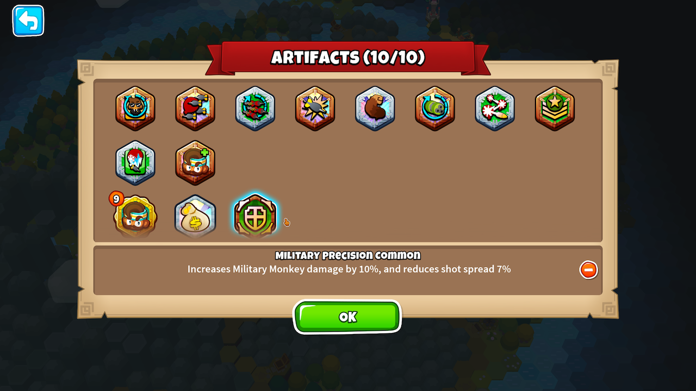

<h1 align="center">

Rogue Remix
</h1>

A modification of BTD6's Rogue Legends game mode.

## Main Changes

This mod is a collection of changes I wanted to try out because I thought they'd increase my own enjoyment and interest
in the Rogue Legends game mode. Many of them were inspired by aspects I enjoyed from other Roguelite games.

- 20+ artifacts buffed, 30+ new artifacts added, but you can only have up to 10 at a time by default
    - More strategy and variety for builds
    - New synergies between artifacts
- No more in game popups for temporary boosts; boosts are permanently obtainable outside of game
    - Choose 1 of 3 to buy from Merchants
- Reroll merchant shops using tokens
- Upgrade Artifacts by finding duplicate copies of them
- Achieve Black Borders for your Hero Loadouts!

### NOTE: You need to have legitimately purchased the DLC to use this mod. Support the devs!

## Recommended Mods

### [Faster Forward](https://github.com/doombubbles/faster-forward) - Speed up the campaign

### [Useful Utilities](https://github.com/doombubbles/useful-utilities) - More hotkey support

## Full Changes

### [All Artifact / Boost Balance Changes](/ArtifactChanges.md)

### [All New Artifacts / Boosts](/NewArtifacts.md)

### Artifact System Changes

Many artifacts have been rebalanced to remove their inherent downsides, but you can now only have a **maximum of 10
artifacts at once** by default
(excluding tokens / boosts). Going over this limit will cause a popup where you need to remove an artifact, similar to
the party limit popup.

Removing artifacts from your inventory is now "Selling" rather than "Discarding"; you will always receive its equivalent
value in tokens back by removing it.

Whenever a reward of a choice of artifacts is presented to you, there is an additional option added of just tokens
(equal to the highest sell value of artifact being offered).

Duplicate artifacts of the same tier you already have can now appear within loot, and on picking them they will
merge together to upgrade to a higher tier. A green upgrade icon appears on the icon if this will happen.

Explanation

It's my opinion that allowing an unlimited number of artifacts at once makes there be less strategic and interesting
gameplay, not more. Builds are homogenized and the synergy between artifacts is made less relevant in the face of just
using Essence of Dreadbloon / Primary Unification and just picking up every artifact at once. Because there's no
inherent
downside to just always picking up a new artifact, NK had to put extra downsides on to the base artifacts that make them
feel less impactful. With an artifact limit those can be removed more easily. As to the upgrading, this

### Boost System Changes

There are no longer boost popups in the middle of the game. Instead, boosts are permanently obtainable bonuses outside
of games that help you scale your party, complementing your artifacts. To compensate for this permanence, the
percentages on boosts' effects have been turned down slightly (-33% effectiveness by default).

Explanation

In game choice popups made a lot of sense in mend-dev's original Rogue mod when it was all taking place within one long
BTD6 game, but now that we have a full progression system outside of the game I feel like the RNG choices are better as
out of game. I think it adds more strategy this way, and also makes the in game flow be more smooth when playing at higher
fast forward speeds like we mod users likely will be.

### Merchant Changes

You can now spend tokens to reroll a Merchant's shop. Starts at a cost of 3 Tokens, and increases by 3 each time per
shop (though you still only make one final trade with the Merchant).

Merchants' inventory always include an extra 3 Boosts available, of which you can purchase one per trade. On Legendary
Shop tiles, one of the boosts will be guaranteed Legendary.

Explanation

Merchant Tiles in base Rogue Legends did not feel that valuable or exciting a lot of the time. With rerolling you should
better be able to find Artifacts that will be actually relevant to your build. Additionally, now that they're the main
source of permanent boosts you can acquire, they should be a lot more enticing to path to on the Map even if you have
to go through extra encounters.

### More Completionist Achievements

You will now get Bronze, Silver, and Gold borders for individual Hero load outs by beating Stages 1 / 3 / 5 with them.
If you beat Stage 5 on Chimps difficulty with them, you will get a Black Border! At the moment the data for runs made
not using this mod does not seem to be saved to the profile, so sadly these can't be awarded retroactively.

Explanation

It felt odd that the only time you can skip was when you'd already lost a life, so it essentially takes 2 lives to skip a tile and not 1.
The goal should be for a Bloon encounter tile to be rewarding enough that you should want to play it rather than skip it.

### Other Changes

You can now "sidegrade" towers at the Campfire Mentor screen, e.g. going from 3-2-0 to 3-0-2

