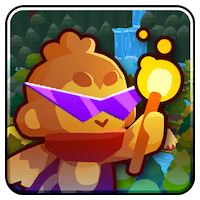
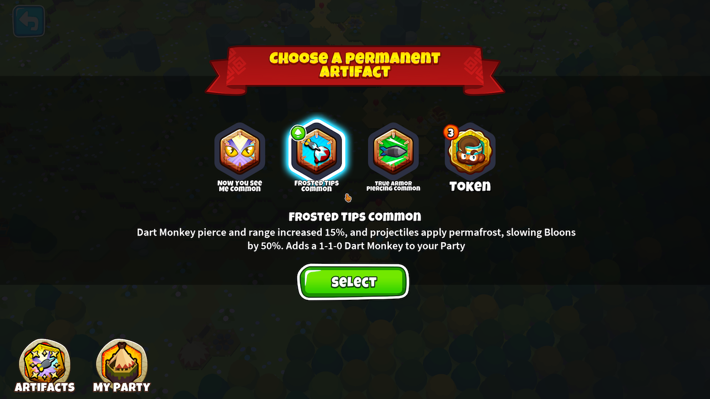
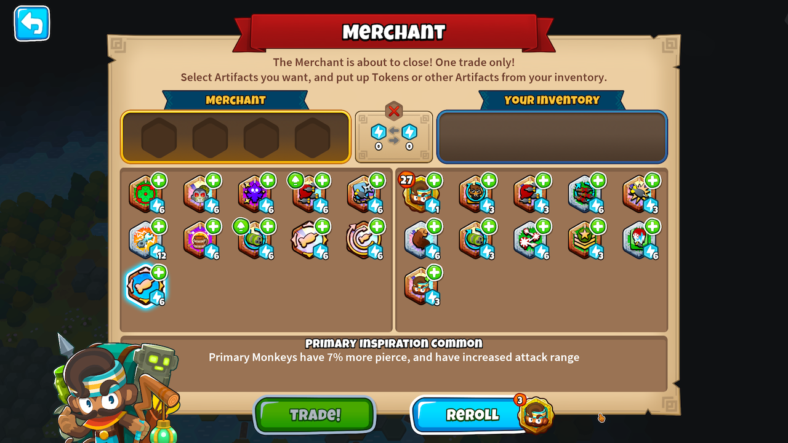
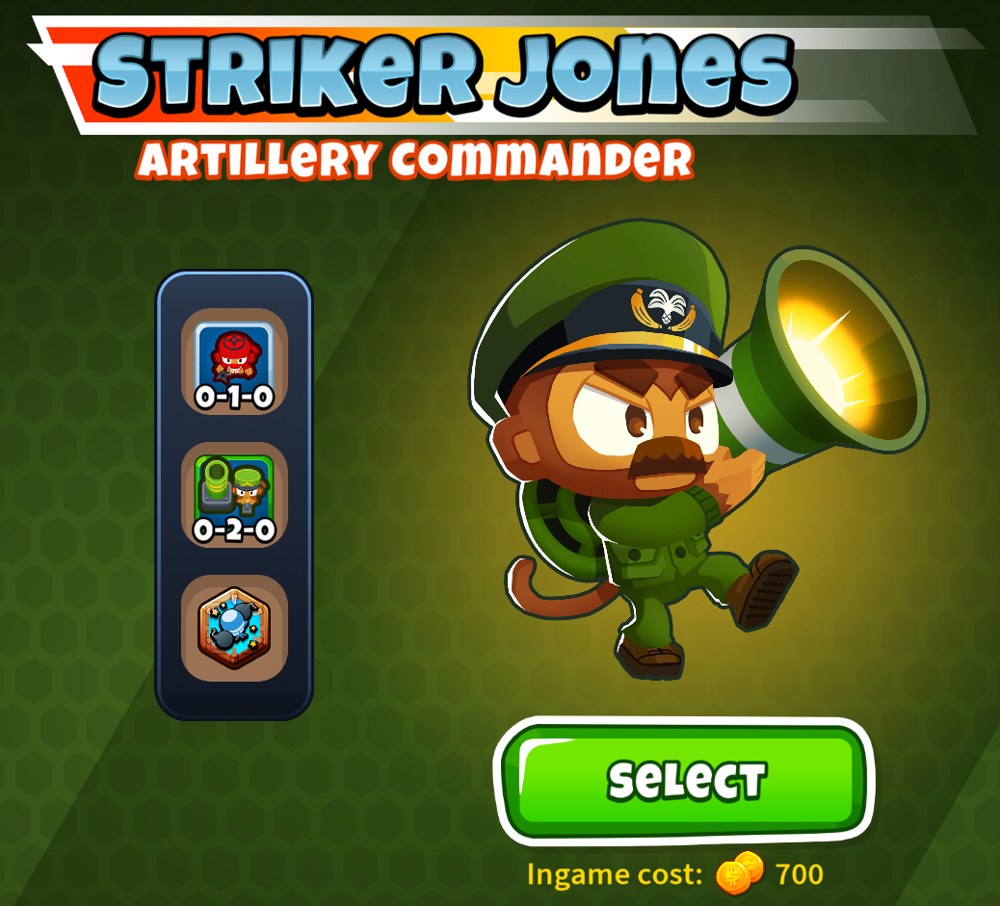
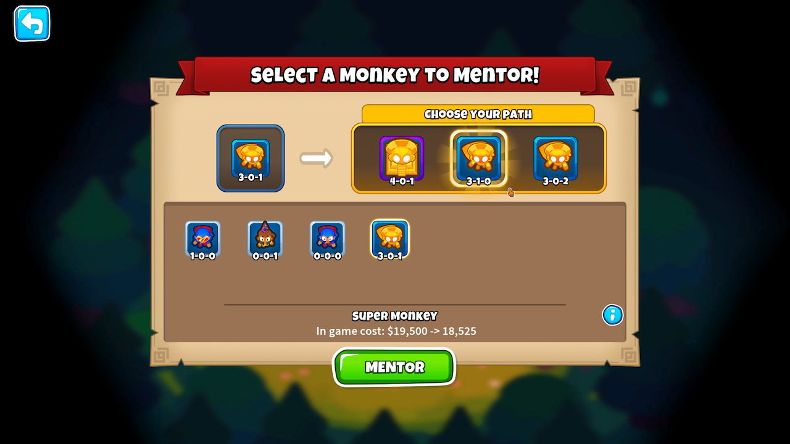

<h1 align="center">

Rogue Remix
</h1>

A modification of BTD6's Rogue Legends game mode.

## Main Changes

This mod is a collection of changes I wanted to try out because I thought they'd increase my own enjoyment and interest
in the Rogue Legends game mode. Many of them were inspired by aspects I enjoyed from other Roguelite games.

- 15+ artifacts buffed, 30+ new artifacts added
    - More strategy and variety for builds
    - New synergies between artifacts
- Obtain permanent versions of boost artifacts
    - Choose 1 of 3 to buy from Merchants
- Reroll merchant shops using tokens
- Upgrade Artifacts by finding duplicate copies of them
- Sidegrade towers at Campfires
- Achieve Black Borders for your Hero Loadouts!

### NOTE: You need to have legitimately purchased the DLC to use this mod. Support the devs!

## Recommended Mods

### [Faster Forward](https://github.com/doombubbles/faster-forward) - Speed up the campaign

### [Useful Utilities](https://github.com/doombubbles/useful-utilities) - More hotkey support

## Full Changes

### [All Artifact / Boost Balance Changes](/ArtifactChanges.md)

### [All New Artifacts / Boosts](/NewArtifacts.md)

### Artifact System Changes

Removing artifacts from your inventory is now "Selling" rather than "Discarding"; you will always receive its equivalent
value in tokens back by removing it.

Whenever a reward of a choice of artifacts is presented to you, there is an additional option added of just tokens
(equal to the highest sell value of artifact being offered).

Duplicate artifacts of the same tier you already have can now appear within loot, and on picking them they will
merge together to upgrade to a higher tier. A green upgrade icon appears on the icon if this will happen.

### Merchant Changes

You can now spend tokens to reroll a Merchant's shop. Starts at a cost of 3 Tokens, and increases by 3 each time per
shop.

Merchants' inventory can now include an extra 3 Permanent Boosts available, of which you can purchase one per merchant
tile.
On Legendary Shop tiles, one of the boosts will be guaranteed Legendary.
As of BTD6 v48, this feature is Default Off due its to power level, but can be enabled in the mod settings.

### More Completionist Achievements

You will now get Bronze, Silver, and Gold borders for individual Hero load outs by beating Stages 1 / 2 / 4 with them.
If you beat Stage 4 on Chimps difficulty with them, you will get a Black Border! At the moment the data for runs made
not using this mod does not seem to be saved to the profile, so sadly these can't be awarded retroactively.

### Other Changes

You can now "sidegrade" towers at the Campfire Mentor screen, e.g. going from 3-2-0 to 3-0-2

